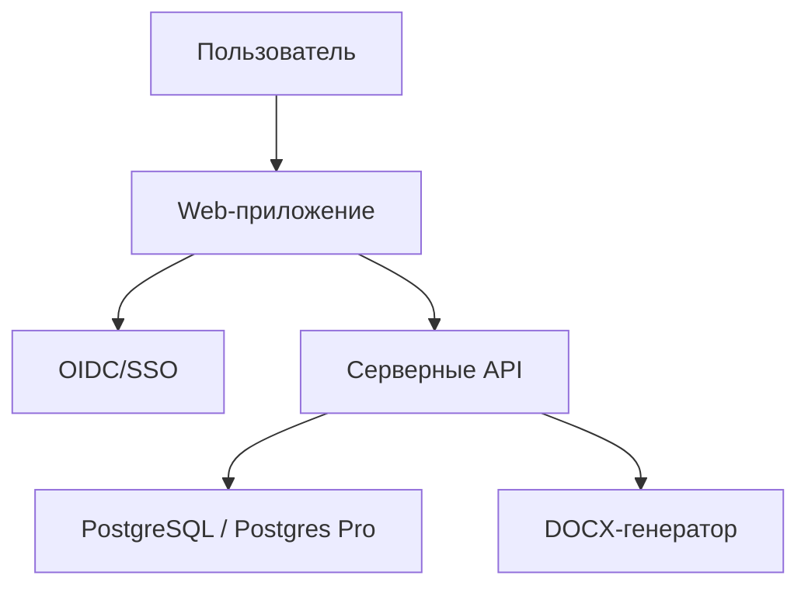

# Перенос конструктора на серверы организации

Этот документ описывает целевую схему варианта `server → БД + авторизация`. Текущая рабочая версия использует Cloudflare D1 и платформенную авторизацию Sites; при переносе эти слои заменяются адаптерами, а интерфейс и бизнес-логика сохраняются.

## Целевая схема

## Компоненты

| Компонент | Назначение | Где менять |
| --- | --- | --- |
| Авторизация | вход пользователя, email, ФИО, стабильный ID | `lib/server-auth.ts` |
| Роли | автор, проверяющий, администратор, активная роль администратора | `lib/roles.ts`, `db/schema.ts` |
| База данных | программы, РПД/РПР, комментарии, статусы | `db/index.ts`, `db/providers/*` |
| DOCX | выгрузка редактируемого документа | `lib/program-export.ts` |
| API | сохранение, проверка, комментарии, выгрузка | `app/api/*` |

## Этапы переноса

1. Создать отдельную БД PostgreSQL/Postgres Pro.
2. Перевести схему `db/schema.ts` с SQLite/D1-типов на PostgreSQL-диалект Drizzle или подготовить эквивалентные SQL-миграции.
3. Реализовать `db/providers/postgres.ts` и переключатель провайдера в `db/index.ts`.
4. Подключить корпоративный OIDC/SSO в `lib/server-auth.ts`.
5. Настроить начального администратора через bootstrap-скрипт или ручную запись в `user_profiles`.
6. Перенести данные из D1, если требуется сохранить уже созданные программы.
7. Проверить права доступа на сервере: автор, проверяющий, администратор.
8. Проверить DOCX-выгрузку по утверждённым макетам.
9. Настроить резервное копирование БД и журнал действий.

## Требования к PostgreSQL

Минимальный набор таблиц:

- `programs`;
- `disciplines`;
- `user_profiles`;
- служебная таблица миграций Drizzle;
- желательно: `audit_log` для действий администратора и проверяющих.

JSON-поля текущей версии (`data`, `field_comments`) при переносе лучше хранить в `jsonb`, а не в `text`.

## Авторизация и роли

OIDC должен возвращать:

- стабильный идентификатор пользователя;
- email;
- ФИО или отображаемое имя, если есть.

Роль не должна выбираться пользователем при регистрации как окончательное право. Пользователь может подать заявку или выбрать желаемую роль, но фактическую роль назначает администратор.

Администратор может переключаться между режимами:

- `admin` — управление пользователями и ролями;
- `author` — проверка интерфейса автора и создание программ;
- `reviewer` — проверка интерфейса проверяющего.

## Запрет на локальное рабочее хранение

Рабочие данные нельзя хранить в IndexedDB/localStorage как основной источник. Допустимо использовать браузерное хранилище только для неважных настроек интерфейса, например раскрытых блоков или последней вкладки.

## Секреты

Не хранить в GitHub:

- `DATABASE_URL`;
- `OIDC_CLIENT_SECRET`;
- токены доступа;
- дампы БД;
- выгруженные программы с персональными данными;
- служебные cookies/session secrets.

Использовать секреты среды запуска: Kubernetes Secret, Docker secret, Vault или аналогичный механизм организации.

## Контроль готовности

Перед промышленным запуском проверить:

- вход через SSO;
- назначение администратора;
- переключение роли администратора;
- создание ДООП, ПК и ПП;
- сохранение РПД/РПР;
- комментарии проверяющего ко всем полям и строкам;
- блокировку отправки при критических ошибках;
- невозможность выгрузки автором до согласования;
- DOCX-порядок разделов, нумерацию, титульный лист, таблицы и литературу.
